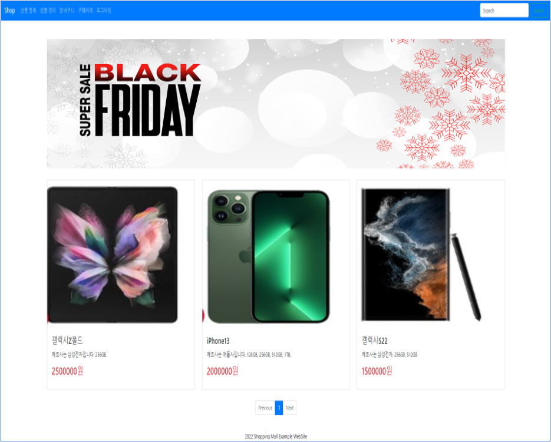
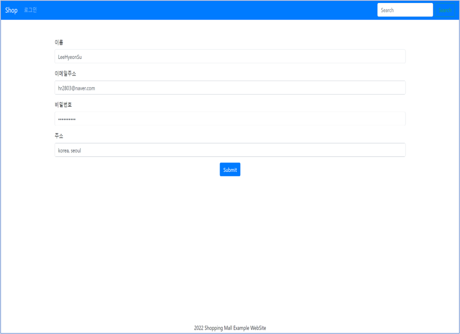
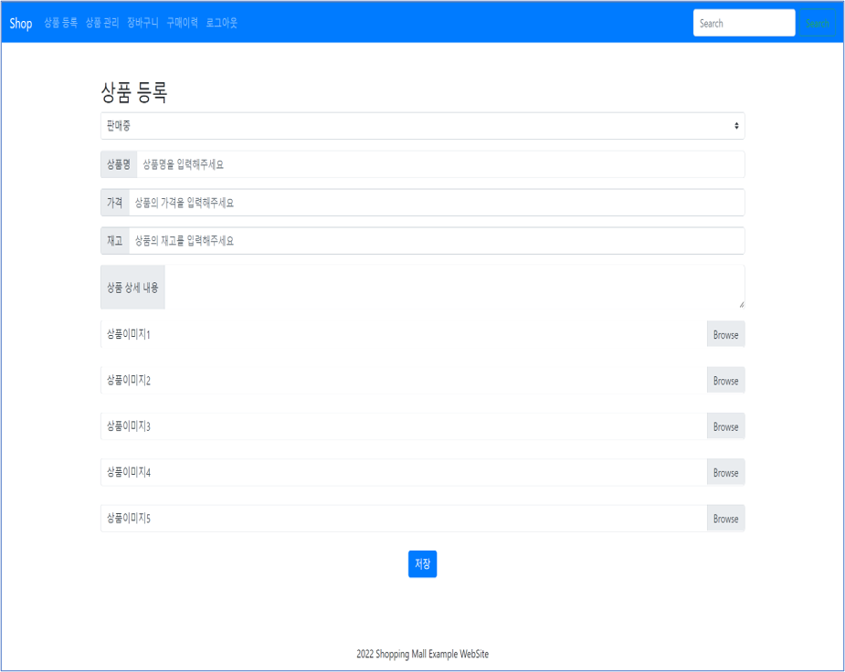
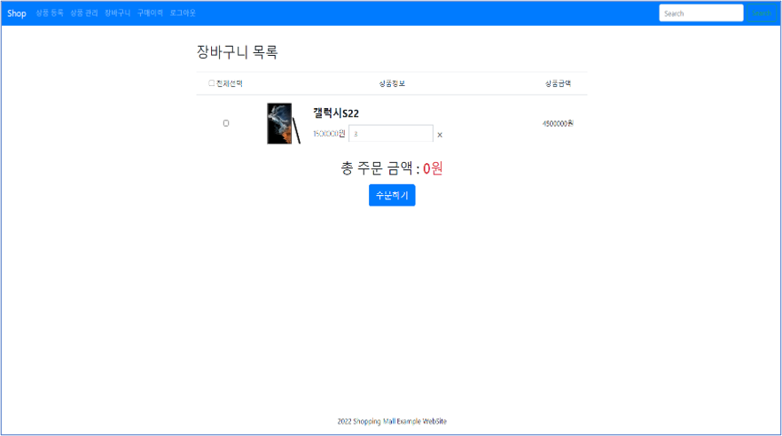
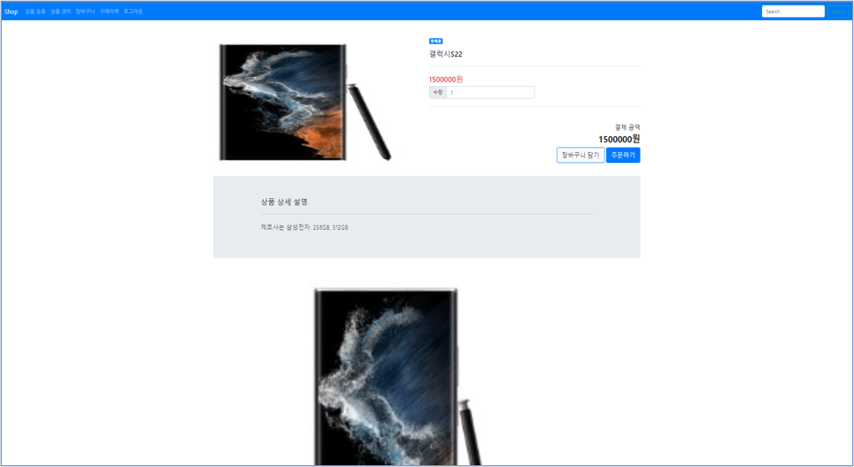
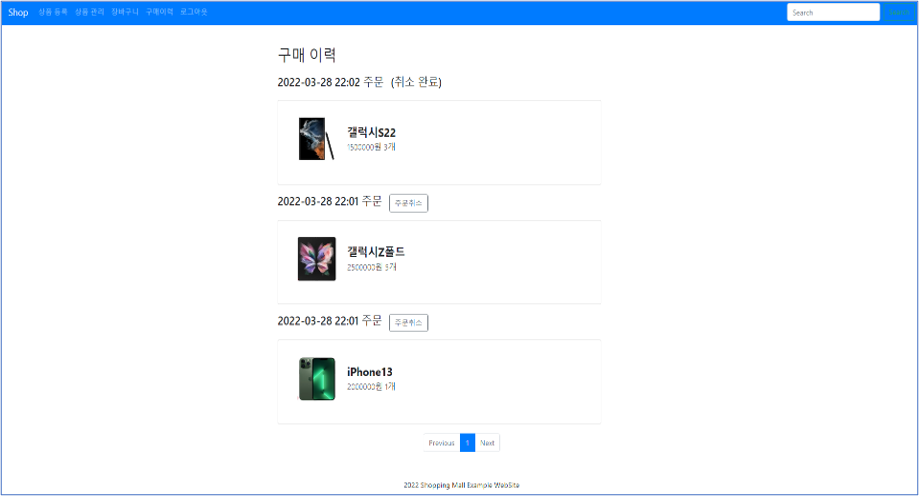
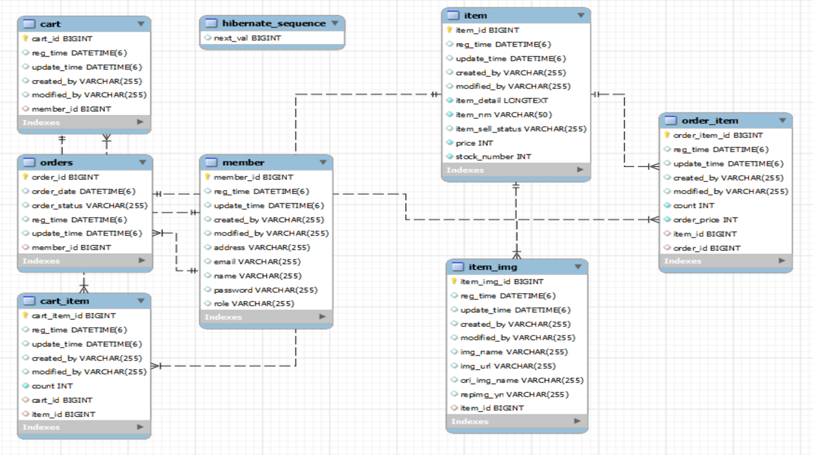

# Shopping mall

Role: Back-end Dev, Front-end Dev, JPA, MySQL, Spring

소요시간: 2022.03 ~ 2022.03

# 주제

로그인, 상품 입력, 장바구니, 주문 등의 기본적인 쇼핑몰 기능을 구현함.

스프링부트 쇼핑몰 프로젝트 with JPA 책을 참고해 클론코딩을 진행함.

---

# 기능

- **메인화면**

- **로그인 / 회원가입**

- **상품추가**

- **장바구니**

- **상품주문**

- **상품취소**

---

# DB

---

# 개발환경 및 사용언어, 기술

- 개발환경 : Intellij IDEA 2021.2.2
- 개발언어 : HTML5, CSS3, JavaScript, JAVA
- DB : MySQL
- 웹 프레임워크 : spring
- 기술 : JPA, thymeleaf, Lombok, 스프링 시큐리티
